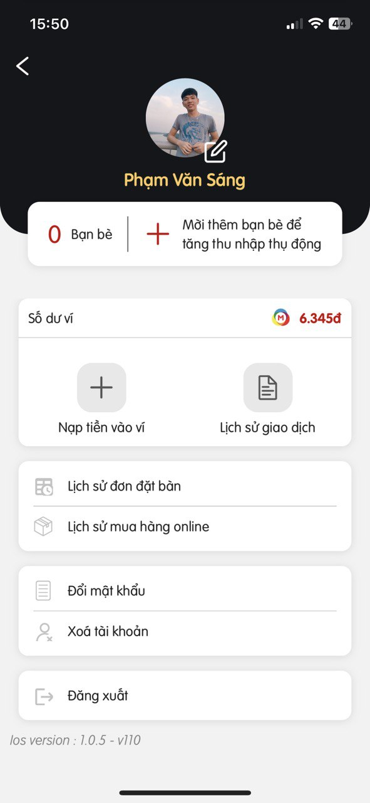

# Earn points, get refunds, order food at the table

Scan QR to earn points, get cashback, or order food at your table with many attractive offers. Provides payment methods, making it easy to shop for products.

## Main functions

- Register an account, update personal information
- Scan QR (earn points, get refunds, order food at the table)
- Shopping for beer products
- Earn points when making purchases on the Mpoint system
- Payment via VNPay portal

## Technologies

- React native -- Axios -- Camera -- React hook -- Redux -- Scan QR -- Carousel -- Reanimated -- Notification -- Typescripts

## Links

- IOS: [https://apps.apple.com/us/app/mbeer/id6447344872](https://apps.apple.com/us/app/mbeer/id6447344872)
- Android: [https://play.google.com/store/apps/details?id=com.mediaone.mbeer](https://play.google.com/store/apps/details?id=com.mediaone.mbeer)

## Screenshots

## Demo

<h6>To view source code, please contact email: sangphamvan.dev@gmail.com</h6>
